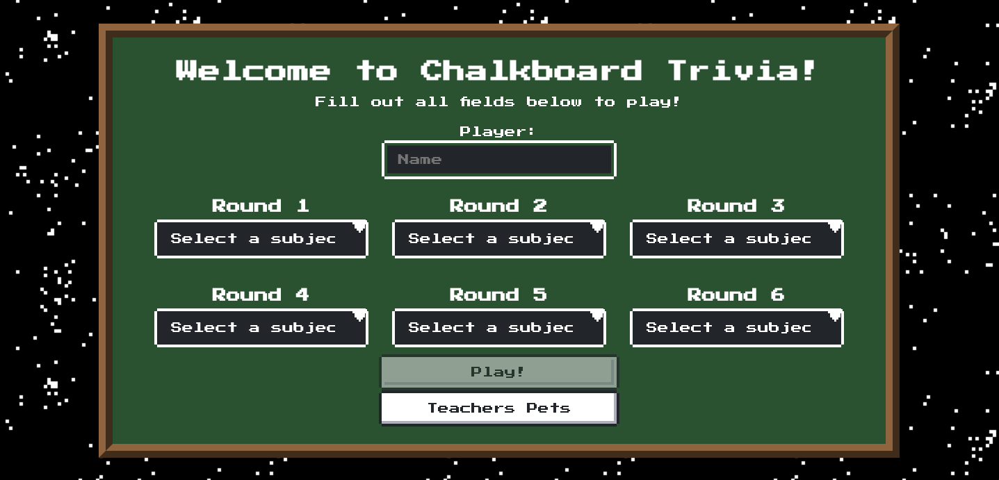

# Chalkboard Trivia

## Abstract

This is the group project from The Turing School of Software & Design's Mod 3 of Front-End Engineering. The assigned objectives were to use an external API and a technology we would teach ourselves to build an application of our own design. We chose to use the [Open Trivia DB](https://opentdb.com/api_config.php) API and Redux to build a trivia game loosely based on schoolhouse themes. 

## Contributors
- [Bill Wilke](https://github.com/Billwilke42)
- [Kyle Wong](https://github.com/KyleWong2510)
- [Liliana Weimer](https://github.com/lilianaweimer)

## Technologies Used
- React
- Redux
- CSS
- Git
- [NES.css](https://nostalgic-css.github.io/NES.css/)
- JavaScript
- React Testing Library
- React Router
- Jest

## In Action

This project was bootstrapped with [Create React App](https://github.com/facebook/create-react-app).